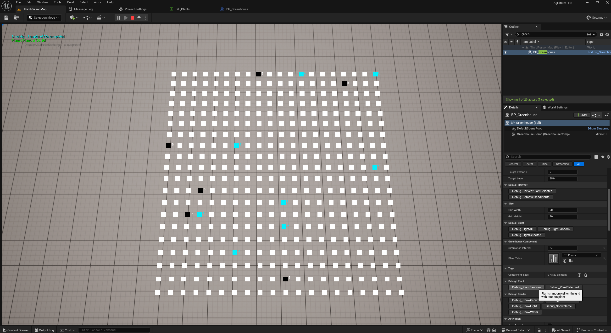
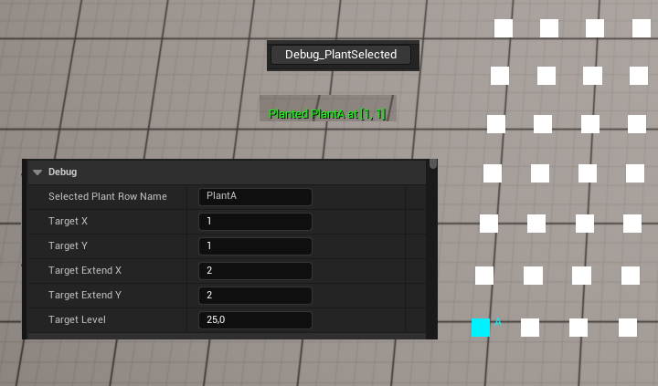
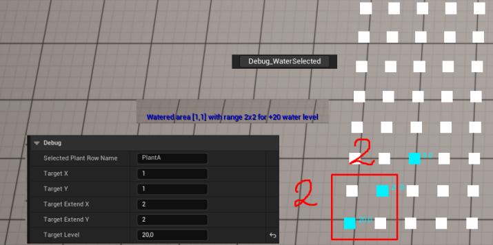
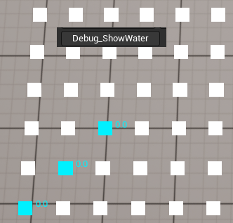
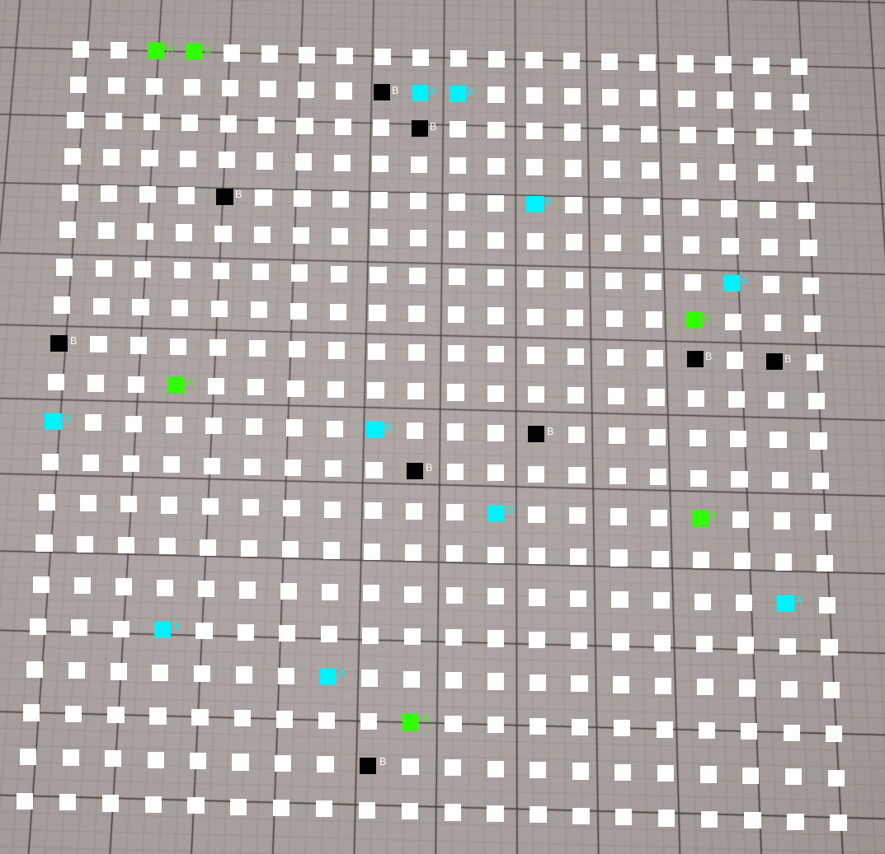

# Тестовое задание для проекта AGRONOM

## Краткая инструкция по запуску

1. Открыть скачанный архив
2. ПКМ по .uproject файлу -> Generate Visual Studio project files
3. Открыть сгенерированный .sln файл и запустить проект
4. При открытии проекта запустить игру, например Alt+P
5. Не двигайте камерой, перед вами появится сетка, отображающая ячейки теплицы
6. Для управления теплицей выберите BP_Greenhouse на сцене (используя Outliner) и используйте различные Debug методы

На скриншоте представлен пример тестирования логики

---

## Инструкция по управлению

В BP_Greenhouse выведены различные методы, помеченные Call in editor для удобства использования в целях отладки
Хочу описать основные, которые могут вызывать вопросы.
В разделе Debug имеются следующие параметры:

- Selected Plant Row Name - параметр который позволяет выбрать конкретное растение, которое будет использоваться в каких либо методах. Так, например оно используется в Debug_PlantSelected и Debug_GetStatistics(для получения количества живых экземпляров указанного растения)

Использование SelectedPlantRowName для посадки конкретного растения
- TargetX, TargetY - указывает на конкретные координаты клетки на сетке. Используется в большинстве методов для операций с конкретной клеткой
- TargetExtendX, TargetExtendY - используются чтобы задать зону например в Debug_WaterSelected - польется прямоугольник из TargetX, TargetY и сторонами равными TargetExtendX, TargetExtendY
- TargetLevel - используется в например Debug_WaterSelected чтобы указать желаемый уровень воды для добавления. Альтернативно используется Debug_ProceedSimulation для указания желаемого количества шагов симуляции

Использование практически всех параметров для демонстрации полива из точки [1,1](на графике самая нижняя левая точка) в квадрате со стороной 2, на 20 единиц воды

Также через функции в Debug|Render можно переключить отображаемый режим(по умолчанию выводится название растения), на скриншоте отображается вода

---

## Что реализовано

- Сетка 20x20 (настраивается через GridWidth и GridHeight в Greenhouse Component)
- Посадка растения в выбранную ячейку по RowName из DataTable
- Полив ячейки, всего поля и прямоугольной области
- Изменение освещения в ячейке, на всем поле и области
- Шаг симуляции с проверкой условий по воде и свету, ростом растений, урону и регенерации от условий
- Стадии роста: Empty (белый квадрат) → Seed (синий квадрат) → Growing (желтый квадрат) → ReadyToHarvest(зеленый квадрат) → Dead (черный квадрат)
- Сбор урожая с созревших растений
- Вывод статистики: занято, созрело, средняя вода, по растению, проблемные(но живые)
- Авто-симуляция по таймеру с настраиваемым интервалом
- Удаление мёртвых растений

Цвета: белый - пусто, синий - семечко, желтый - растёт, зеленый - готово к сбору, черный - погибло

---

## Как устроена архитектура

- FPlantData DT_Plants - это таблица растений, где указаны все параметры каждого уникального растения, от названия до требований по поливу
- FGreenhouseCell - состояние отдельной ячейки, отдельной грядки в теплице, где указываются например текущее здоровье растения, уровень воды и т.д.
- GreenhouseComponent - вся логика: посадка, полив, свет, симуляция, статистика. Используем компонент для удобства дальнейшего использования и разделения логики
- AGreenhouseActor - актор-обертка, на котором висит наш компонент
- BP_Greenhouse - наследуется от плюсового актора AGreenhouseActor и отвечает за визуализацию состояния теплицы. Через него также можно управлять теплицей, используя Debug методы, описанные выше

---

## Где хранятся данные ячеек и растений

- Ячейки хранятся в TArray FGreenhouseCell внутри UGreenhouseComponent
- Растения хранятся в DT_Plants со строками типа FPlantData

---

## Как работает шаг симуляции

1. Метод StepSimulation(NumSteps) проходит по всем ячейкам указанное количество NumSteps раз
2. Для каждой занятой ячейки ProcessCell проверяет воду и свет в диапазоне от RequiredMin до RequiredMax в соотсветствии с параметрами самого растения
3. Если условия хорошие - идёт рост и регенерация здоровья. Если плохие - урон здоровью и рост останавливается 
4. Помимо этого, происходит потребление воды и света также в соотвествии с конфигурацией растения
5. Если здоровье падает до нуля - растение умирает, но остается на поле
6. Когда GrowthProgress достигает целевого значения(также указывается свое для каждого растения в табличке) - происходит переход на следующую стадию: Seed -> Growing -> ReadyToHarvest

---

## Граница между C++ и Blueprint

- C++ отвечает за данные и алгоритмы: структуры FGreenhouseCell и FPlantData, компонент UGreenhouseComponent со всей логикой симуляции и статистикой, публичное API через UFUNCTION(BlueprintCallable)
- Blueprint отвечает за настройку и отображение: BP_Greenhouse содержит визуализацию через DrawDebugBox, дебаг-сценарии типа PlantRandom и WaterRandom, которые используют методы компонента UGreenhouseComponent

---

## Компромиссы

- Визуализация в Blueprint - дебаг-отрисовка сделана в Blueprint для скорости разработки. Даже для 20x20 ячеек это на самом деле не очень хорошее решение, а при масштабировании нужно перенести в C++
- FName вместо индекса для растения - храню FName PlantRowName (8 байт) вместо int32 (4 байта). Для 400 ячеек это незначительно, но это даёт устойчивость к изменению порядка строк в DataTable и читаемость при отладке. При масштабировании до 100K+ ячеек стоит использовать индекс
- AoS вместо SoA - выбран подход «массив структур», а не «структура массивов», т.к. для 400 ячеек это даёт читаемый код и простой доступ к полям. При дальнейшем расширении до 1000x1000, стоит перейти на SoA
- Таймер инициализируется сразу же, что с одной стороны удобно для отладки, а с другой стороны это может быть проблемой, если у нас будет тикать множество пустых грядок

---

## Что бы улучшил за 2-3 часа

- Визуализацию перенёс бы в C++, в первую очередь. А если речь идет еще и о дальнейшем расширении системы - это просто необходимо для оптимизации и корректной работы
- Добавил бы различных более удобных менюшек, например UI для более простого управления и дебага теплицы
- Если опять таки речь идет о дальнейшем расширении, то стоит также реализовать так называемую пакетную систему с параллельной обработкой
- Можно было бы сильно расширить параметры растений, добавить более тонкую настройку, может добавить какие то еще влияющие факторы, вроде болезней

---

## Сколько времени заняло

- Выполнение самого тестового задания, планирование и выстраивание архитектуры заняло около 6 часов
